# 一、系统说明

基于springboot+vue+elementui开发的校园博客系统,系统功能齐全, 代码简洁易懂，适合小白学编程。

# 二、系统架构

###### ?????前端：vue| elementui

###### ?????后端：springboot | mybatis?

###### ?????环境：jdk1.8+ | mysql8.0+ | maven

# 三、代码及数据库

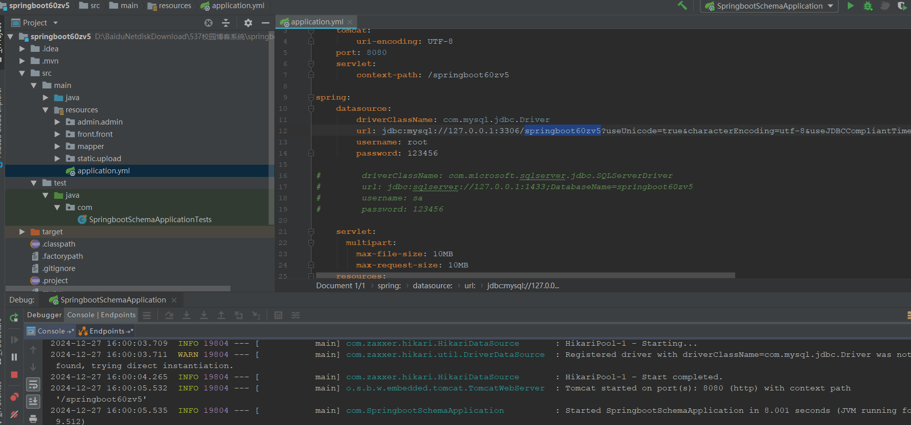

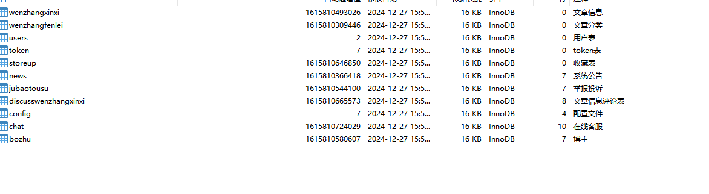

# 四、相关功能介绍

#### 1).客户端

###### 1.登录

###### 2.注册

###### 3.首页

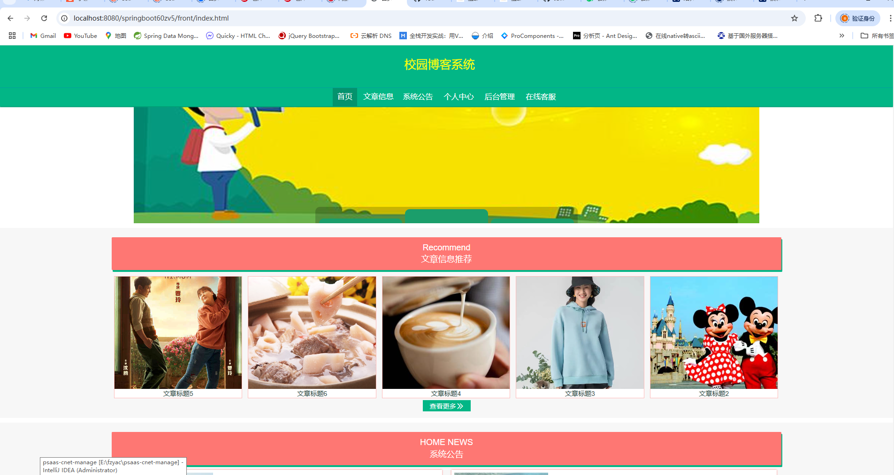

###### 4.文章信息

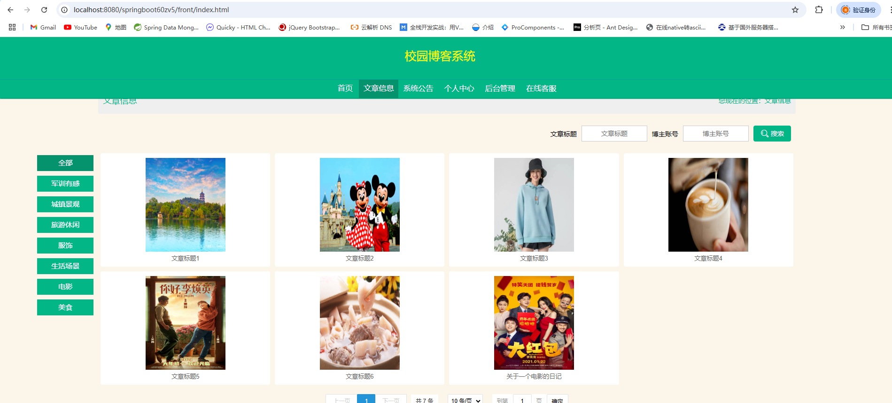

###### 5.系统公告

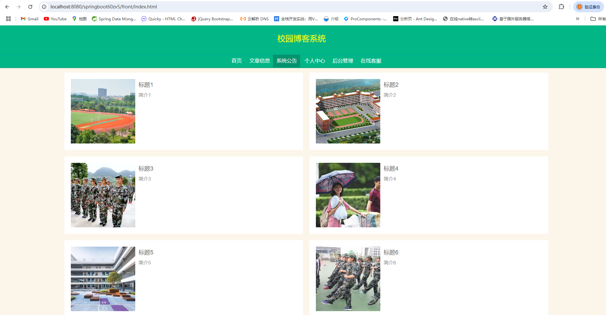

###### 6.个人中心

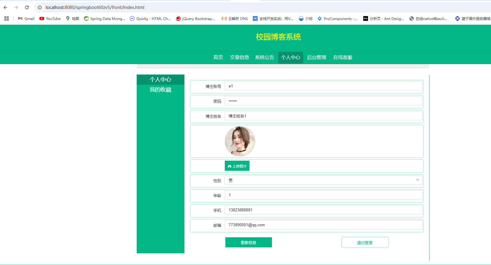

###### 7.个人中心-我的收藏

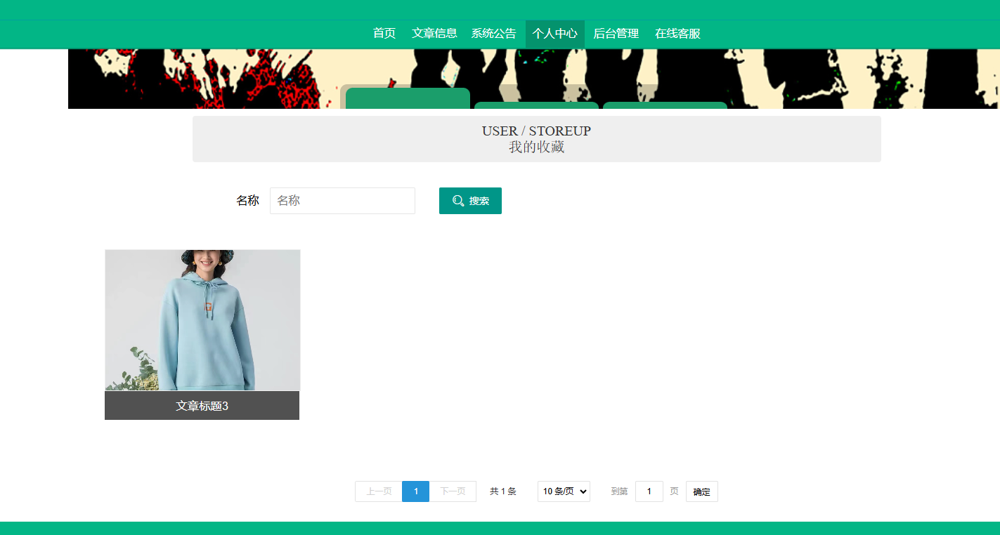

###### 8.在线客服

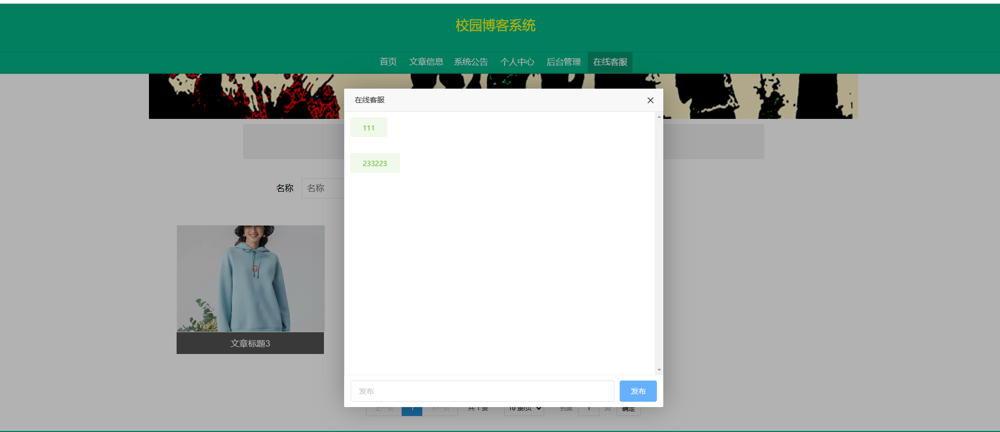

###### 9.后台管理->修改密码

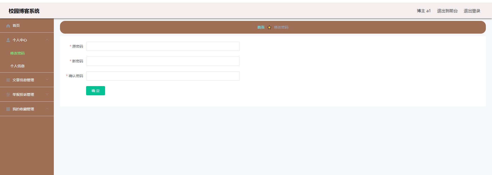

###### 10.后台管理->文章信息

包含:发布文章、修改、删除功能

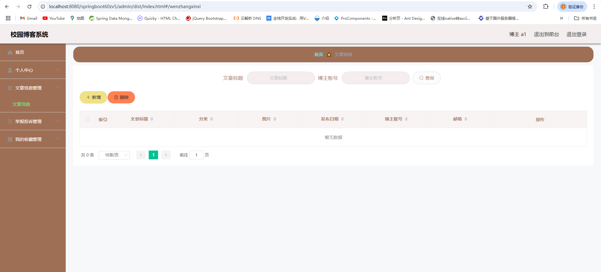

###### 11.后台管理->举报投诉管理

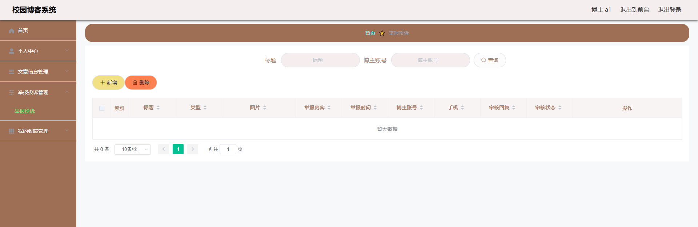

#### 2).管理端

###### 1.登录

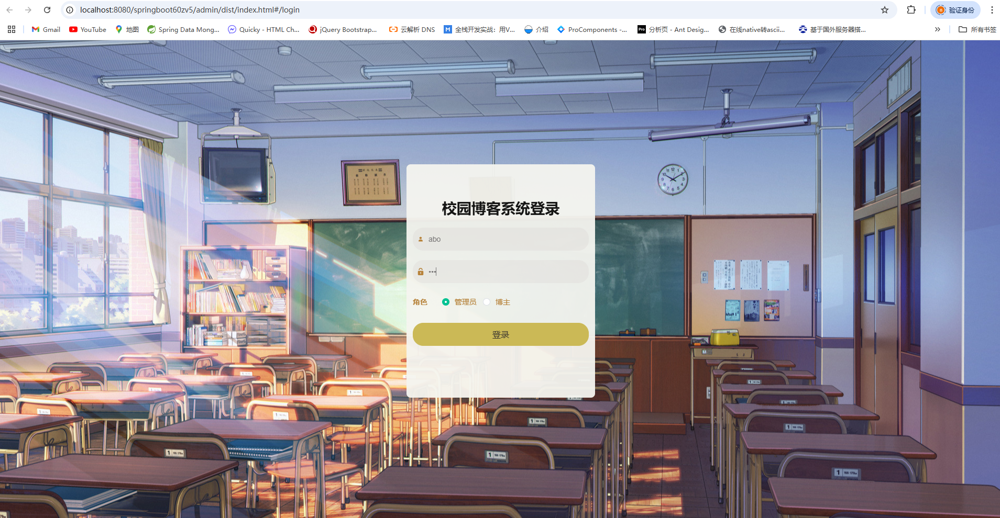

###### 2.个人中心->修改密码

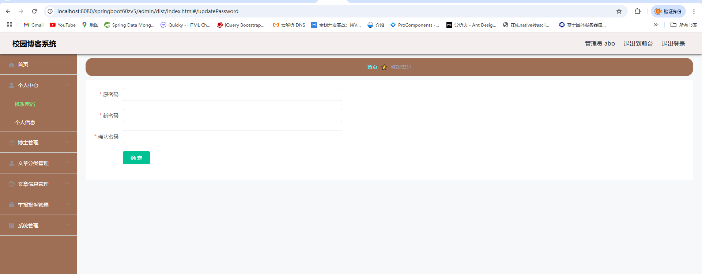

###### 3.博主管理

包含:详情、删除、修改、查看、新增功能

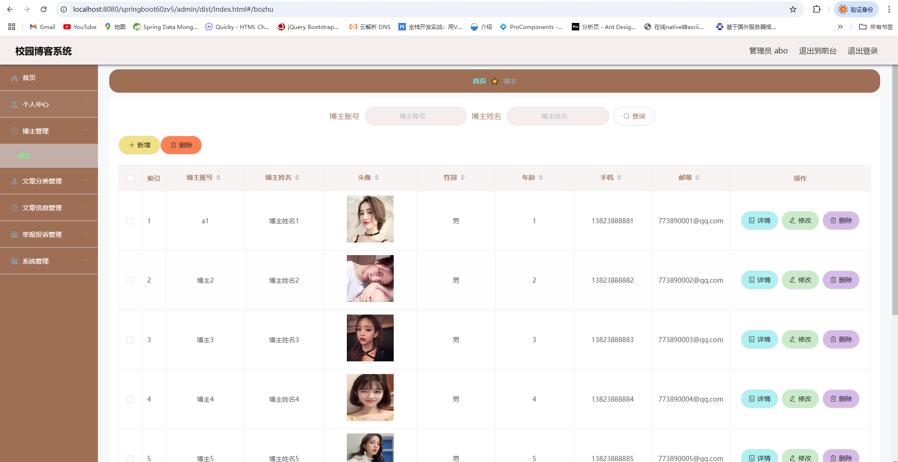

###### 4.文章分类管理

包含:详情、删除、修改、查看、新增功能

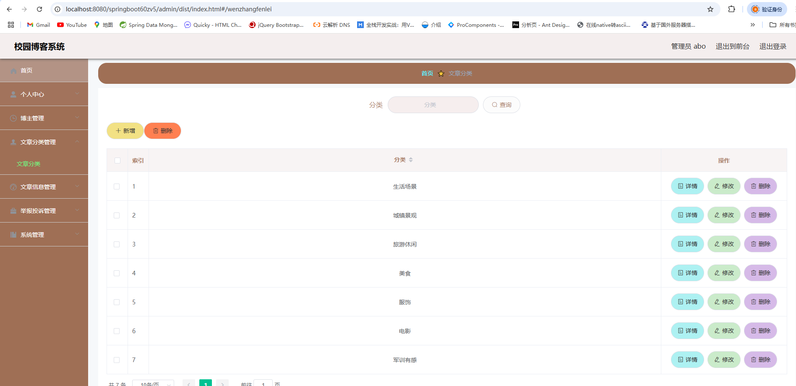

###### 5.文章评论管理

包含:详情、删除、修改、查看、新增功能

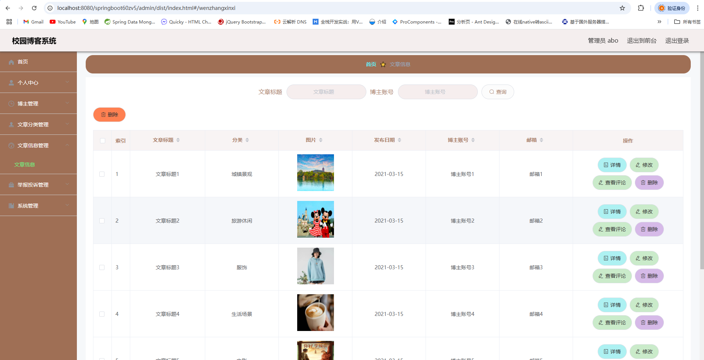

###### 6.举报投诉

包含:详情、删除、修改、查询、审核功能

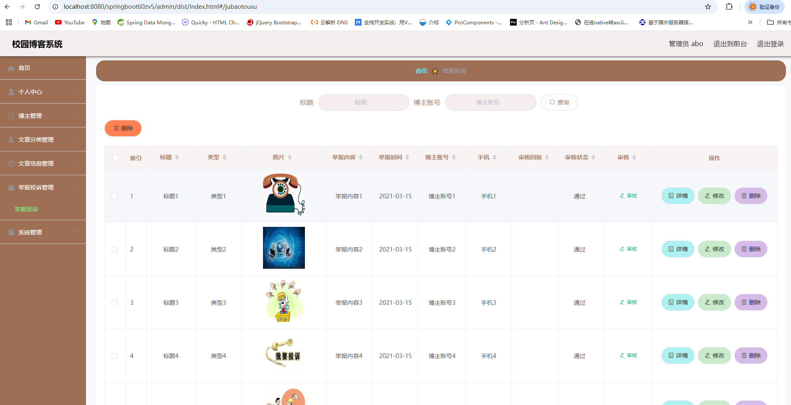

###### 7.系统管理->轮播图管理

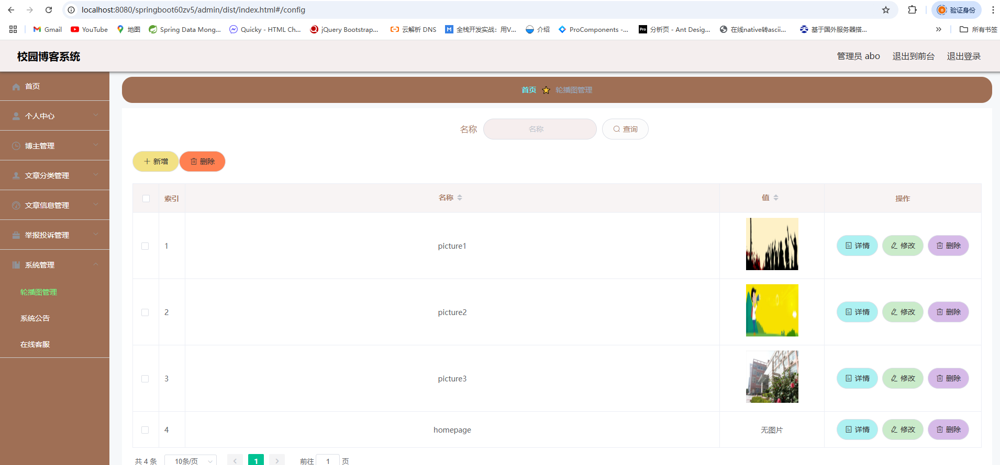

###### 8.系统管理->公告管理

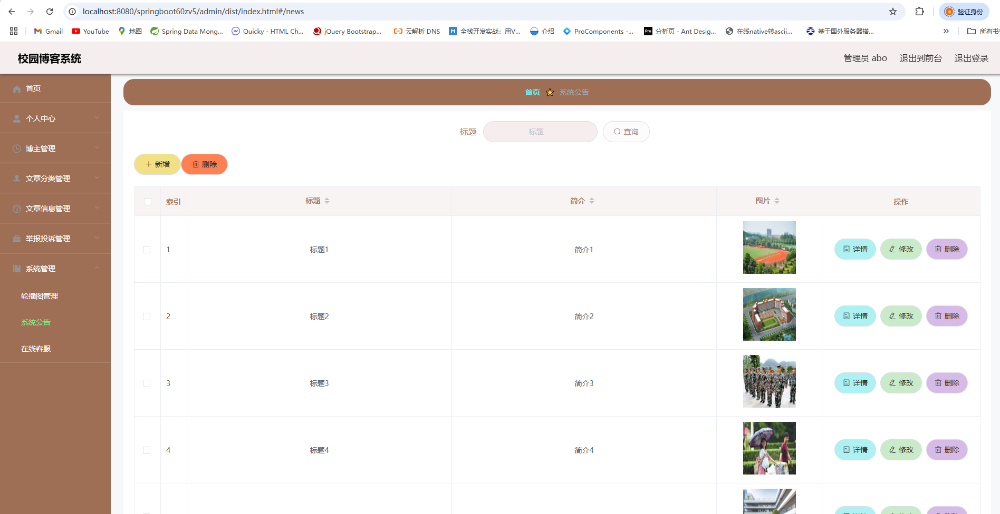

###### 8.系统管理->在线客服

包含:回复功能

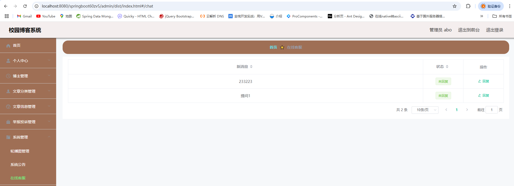

######
